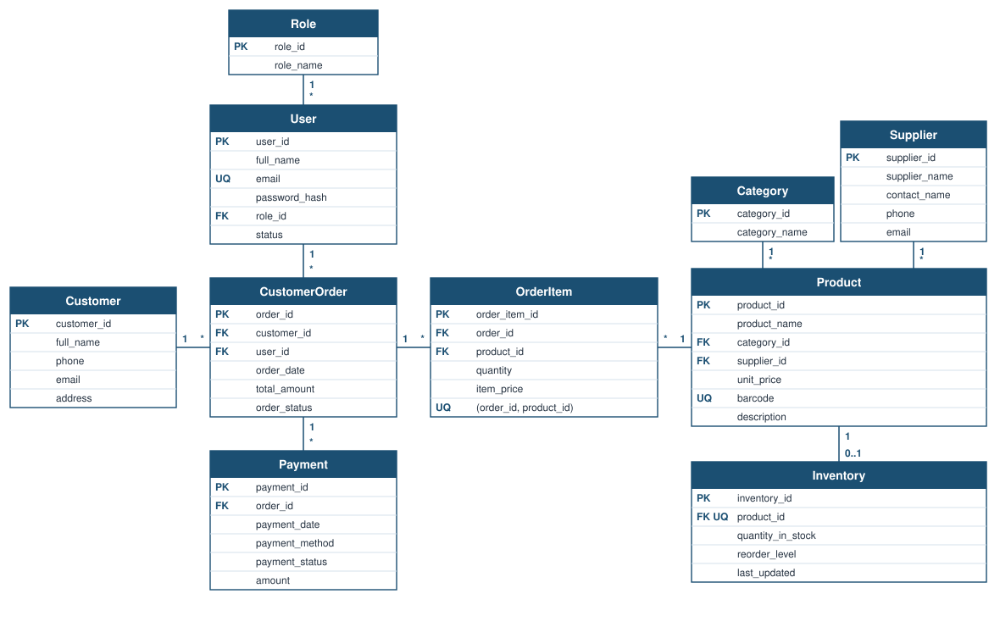

# Retail Database System with Python and SQLite

A small relational retail database built with Python's standard-library `sqlite3` module and SQL. It models staff roles and users, customers, suppliers, categories, products, inventory, customer orders, order items, and payments.

The repository focuses on relational schema design, data integrity, reproducible database creation, business-oriented SQL queries, and automated database testing.

## Key Features

- A 10-table relational SQLite schema.
- Primary keys and foreign keys for the retail relationships.
- `PRAGMA foreign_keys = ON` for application and test connections.
- `NOT NULL` foreign keys where a relationship is required.
- `CHECK` constraints for non-negative prices, stock, order totals, and payment amounts, and for the status and method values used by the schema.
- `UNIQUE` constraints, including `Product.barcode` and `OrderItem (order_id, product_id)`.
- A reproducible rebuild from `sql/create_tables.sql` and `sql/seed.sql`.
- Reports run on a connection with `PRAGMA query_only = ON`.
- Three business reports: order contents, low stock, and payment status.
- Automated tests that use an in-memory database or a temporary file.
- No third-party Python dependencies.

## Database Schema



The diagram shows the ten tables and their relationships. `OrderItem` resolves the many-to-many relationship between `CustomerOrder` and `Product`, and each line stores `quantity` and `item_price`. `Product` to `Inventory` is 1 to 0..1 because `Inventory.product_id` is unique: every stock row belongs to one product, and a product has at most one stock row. The editable diagram source is `docs/er-diagram.drawio`.

| Table | Purpose |
| --- | --- |
| Role | Staff role name |
| User | Staff member and assigned role |
| Customer | Customer name and contact details |
| Supplier | Supplier name and contact details |
| Category | Product category |
| Product | Sellable item, price, category, and supplier |
| Inventory | Quantity on hand and reorder level for one product |
| CustomerOrder | Order header, customer, staff user, and stored total |
| OrderItem | One product line on an order |
| Payment | A payment recorded against an order |

## Data Integrity

Application and test connections enable `PRAGMA foreign_keys = ON`. Required relationships are `NOT NULL` foreign keys: a user has a role, a product has a category and a supplier, an inventory row belongs to a product, an order belongs to a customer and a staff user, an order line belongs to an order and a product, and a payment belongs to an order.

Prices, stock quantities, reorder levels, order totals, and payment amounts cannot be negative. `OrderItem.quantity` must be greater than zero. `Product.barcode` is unique. `Inventory.product_id` is unique. `OrderItem` has `UNIQUE (order_id, product_id)`, so the same product appears at most once on an order. `User.email` is also unique.

Allowed values are small and explicit:

- `User.status`: `Active`, `Inactive`
- `CustomerOrder.order_status`: `Pending`, `Completed`
- `Payment.payment_method`: `Card`, `Cash`
- `Payment.payment_status`: `Paid`, `Pending`

Foreign keys keep SQLite's default `NO ACTION` behaviour. Deleting a referenced retail row fails when another row still points at it.

## Payments

`Payment.amount` is required and must be greater than or equal to zero. `Payment.order_id` is not unique, so the schema can store more than one payment row for the same order. The sample program does not implement a payment workflow; it loads the seed data and reports the stored rows.

## Order Totals

`CustomerOrder.total_amount` is a stored order total. The schema does not recalculate it. Tests check that each seeded total matches `SUM(OrderItem.quantity * OrderItem.item_price)` with `math.isclose`, because these money columns are SQLite `REAL` values.

## Example Reports

The reports in `sql/queries.sql` are read-only `SELECT` statements.

**order_contents** lists who bought which product, and in what quantity, on which order.

**low_stock** lists products whose stock is below the reorder level.

```sql
SELECT
    Product.product_name,
    Inventory.quantity_in_stock,
    Inventory.reorder_level
FROM Product
JOIN Inventory ON Product.product_id = Inventory.product_id
WHERE Inventory.quantity_in_stock < Inventory.reorder_level;
```

**payment_status** lists each order's payment method, status, and amount.

## Sample Database

`python3 main.py` rebuilds the sample database at `database/retail.db` from `sql/create_tables.sql` and `sql/seed.sql`, then prints the three reports. Schema and seed data are loaded in one transaction. Running the command again replaces that sample file and produces the same rows and report output.

That rebuild is for this generated demo database. `.gitignore` ignores `database/*.db`, so the database file is created locally from the SQL scripts.

## Running the Project

Python 3 with the standard-library `sqlite3` module is enough.

```bash
python3 main.py
```

The tests do not open `database/retail.db`. Schema and report tests use an in-memory database. Lifecycle tests rebuild a temporary `retail.db`.

```bash
python3 -m unittest discover -s tests -v
```
